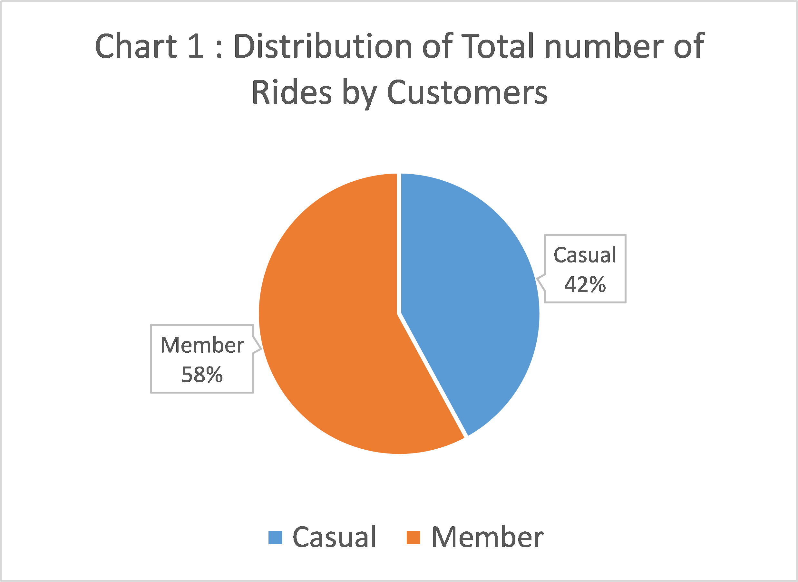
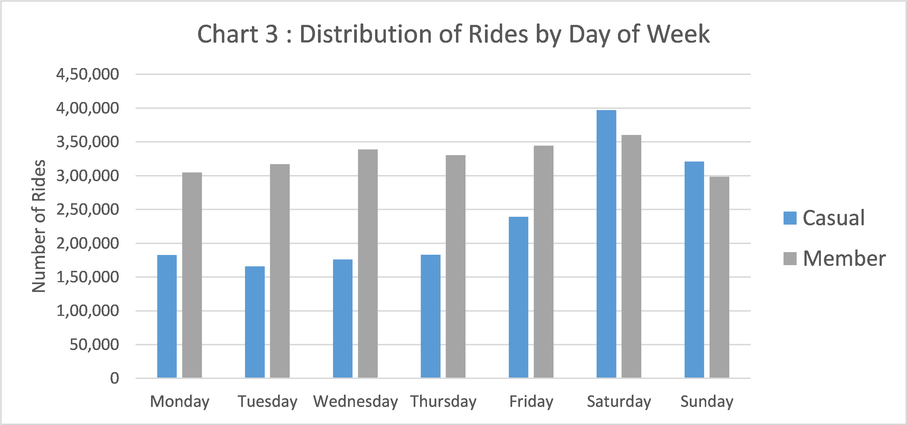

<style type="text/css"> 
/* Table */
.tg{border-collapse: collapse; border-spacing: 0;}.tg td{border-color: black; border-style: solid; border-width: 1px; font-family: Arial, sans-serif; font-size: 14px; text-align: left; vertical-align: top; overflow: hidden; padding: 10px 5px; word-break: normal;}.tg th{border-color: black; border-style: solid; border-width: 1px; font-family: Arial, sans-serif; font-size: 16px; font-weight: bold; text-align: center; vertical-align: top; overflow: hidden; padding: 10px 5px; word-break: normal;}.tb{border-left: 0px solid !important; border-top: 0px solid !important; border-bottom: 0px solid !important;}

 /* Image */
.row {
  display: flex;
}

.column {
  flex: 50%;
  padding: 15px;
}
</style>


<hr style="border:1px solid gray"> </hr>

## 1. Background

<div style="text-align: justify">
In 2016, A Company launched a successful bike-share offering. Since then, the 
program has grown to a fleet of 5,824 bicycles that are geo-tracked and locked 
into a network of 692 stations across Chicago. The bikes can be unlocked from 
one station and returned to any other station in the system anytime.

Company sets itself apart by also offering reclining bikes, hand tricycles, and 
cargo bikes, making bike-share more inclusive to people with disabilities and 
riders who can’t use a standard two-wheeled bike. The majority of riders opt for traditional bikes; about 8% of riders use the assistive options. Users are more 
likely to ride for leisure, but about 30% use them to commute to work each day.

Company's pricing plans: single-ride passes, full-day passes, and
annual memberships. Customers who purchase single-ride or full-day passes are 
referred to as casual riders. Customers who purchase annual memberships are 
members.
</div>
## 2. Objective

<div style="text-align: justify">
Maximize the number of annual subscription members for future growth by 
converting casual riders into annual subscribers.
</div>
## 3. Business Task

<div style="text-align: justify">
Understand difference between bike usage of annual members and casual riders to 
help marketing analyst team achieve objective.
</div>

<hr style="border:1px solid gray"> </hr>

## 4. Data Description
<div style="text-align: justify">
Dataset used is collected and hosted by the company which Consist of there 
customer's bike usage data between June 2020 to May 2021. It contains information about ride type, start and end station name with location and customer type causal or member. It is appropriate, complete and latest to address business task at hand, however 7.72% of rows missing at least one value. Original dataset is available at [http://tiny.cc/ridedata](https://divvy-tripdata.s3.amazonaws.com/index.html)
</div>

```{} 
 [1] "ride_id"             [2] "rideable_type"     
 [3] "started_at"          [4] "ended_at"          
 [5] "start_station_name"  [6] "start_station_id"  
 [7] "end_station_name"    [8] "end_station_id"    
 [9] "start_lat"          [10] "start_lng"         
[11] "end_lat"            [12] "end_lng"           
[13] "member_casual"    
```

<br><h4><b>Table 1 : </b>Dataset Sample, First 10 Rows :- </h4>
<table class="tg"> <thead><tr><th>ride_id</th> <th>rideable_type</th> <th>started_at</th> <th>ended_at</th> <th>start_station_name</th> <th>end_station_name</th> <th>member_casual</th> </tr></thead> <tbody><tr> <td>02668AD35674B983</td><td>docked_bike</td><td>2020-05-27 10:03:52 UTC</td><td>2020-05-27 10:16:49 UTC</td><td>Franklin St &amp; Jackson Blvd</td><td>Wabash Ave &amp; Grand Ave</td><td>member</td></tr><tr> <td>7A50CCAF1EDDB28F</td><td>docked_bike</td><td>2020-05-25 10:47:11 UTC</td><td>2020-05-25 11:05:40 UTC</td><td>Clark St &amp; Wrightwood Ave</td><td>Clark St &amp; Leland Ave</td><td>casual</td></tr><tr> <td>2FFCDFDB91FE9A52</td><td>docked_bike</td><td>2020-05-02 14:11:03 UTC</td><td>2020-05-02 15:48:21 UTC</td><td>Kedzie Ave &amp; Milwaukee Ave</td><td>Kedzie Ave &amp; Milwaukee Ave</td><td>casual</td></tr><tr> <td>58991CF1DB75BA84</td><td>docked_bike</td><td>2020-05-02 16:25:36 UTC</td><td>2020-05-02 16:39:28 UTC</td><td>Clarendon Ave &amp; Leland Ave</td><td>Lake Shore Dr &amp; Wellington Ave</td><td>casual</td></tr><tr> <td>A79651EFECC268CD</td><td>docked_bike</td><td>2020-05-29 12:49:54 UTC</td><td>2020-05-29 13:27:11 UTC</td><td>Hermitage Ave &amp; Polk St</td><td>Halsted St &amp; Archer Ave</td><td>member</td></tr><tr> <td>1466C5B39F68F746</td><td>docked_bike</td><td>2020-05-29 13:27:24 UTC</td><td>2020-05-29 14:14:45 UTC</td><td>Halsted St &amp; Archer Ave</td><td>May St &amp; Taylor St</td><td>member</td></tr><tr> <td>2500D7957D4D0A34</td><td>docked_bike</td><td>2020-05-20 12:51:41 UTC</td><td>2020-05-20 13:46:47 UTC</td><td>Hermitage Ave &amp; Polk St</td><td>Hermitage Ave &amp; Polk St</td><td>member</td></tr><tr> <td>ED42D3E06AFB2F26</td><td>docked_bike</td><td>2020-05-06 18:21:42 UTC</td><td>2020-05-06 19:07:07 UTC</td><td>Ritchie Ct &amp; Banks St</td><td>Ritchie Ct &amp; Banks St</td><td>casual</td></tr><tr> <td>23AFBD962F9C8F14</td><td>docked_bike</td><td>2020-05-30 17:00:58 UTC</td><td>2020-05-30 17:19:52 UTC</td><td>Halsted St &amp; Clybourn Ave</td><td>Broadway &amp; Barry Ave</td><td>casual</td></tr><tr> <td>52C0D13F6B81C5F8</td><td>docked_bike</td><td>2020-05-23 10:22:02 UTC</td><td>2020-05-23 10:52:02 UTC</td><td>Damen Ave &amp; Cortland St</td><td>Western Ave &amp; Division St</td><td>casual</td></tr></tbody></table>


<hr style="border:1px solid gray"> </hr>

## 5. Data cleaning Log

<div style="text-align: justify">
* Found number of rows with at least one missing value is 314299 or 7.72% of total dataset.

* Backed up original dataset and removed those rows.

* However 7.72% is nearly 1 month worth of data. To compensate for the loss cleaned & added May 2020 data to the dataset.

* Removed columns 'start_station_id', 'end_station_id', 'start_lat', 'start_lng','end_lat' and 'end_lng'.

* After cleaning, Dataset contains approximately 4M records.

* Generated "trip duration(in minutes)" for each ride from start(started_at) and end(ended_at) trip time.

* Generated "day of week" ride was started by using ride start time(started_at).

```{} 
 [1] "ride_id"             [2] "rideable_type"     
 [3] "started_at"          [4] "ended_at"          
 [5] "start_station_name"  [6] "end_station_name"
 [7] "member_casual"       [8] "ride_length_in_min"
 [9] "day_of_week"
```
</div>


<hr style="border:1px solid gray"> </hr>

## 6. Summary of Analysis

<style type="text/css"> .tg{border-collapse: collapse; border-spacing: 0;}.tg td{border-color: black; border-style: solid; border-width: 1px; font-family: Arial, sans-serif; font-size: 14px; text-align: left; vertical-align: top; overflow: hidden; padding: 10px 5px; word-break: normal;}.tg th{border-color: black; border-style: solid; border-width: 1px; font-family: Arial, sans-serif; font-size: 16px; font-weight: bold; text-align: center; vertical-align: top; overflow: hidden; padding: 10px 5px; word-break: normal;}.tb{border-left: 0px solid !important; border-top: 0px solid !important; border-bottom: 0px solid !important;}</style><br><h4><b>Table 2 : </b>Distribution from May 2020 to May 2021 :- </h4><h5 style="text-align: justify">Below table describes bike usage pattern of two customer types Casual and Members from May 2020 to May 2021. It shows total number of rides taken by Casual customers and Members respectively, their average ride length in minutes and time of longest and shortest rides.</h5><br><table class="tg"> <thead> <tr> <th>Customer Type</th> <th>Number of Rides</th> <th>Average Ride Time</th> <th>Max Ride Time</th> <th>Min Ride Time</th> </tr></thead> <tbody> <tr> <td>Casual</td><td>1664875</td><td>44 min</td><td>37.7 days</td><td>1 min</td></tr><tr> <td>Member</td><td>2294132</td><td>18 min</td><td>28.6 days</td><td>1 min</td></tr></tbody></table><br><h4><b>Table 3 : </b>Distribution by Day of Week :- </h4><h5 style="text-align: justify">Below table further groups the dataset by days of week to gain insight on usage pattern of Casual customers and Members by Number of rides taken and Average ride length in minutes over a week by days.</h5><br><table class="tg"> <thead> <tr> <th class="tb"></th> <th colspan="2">Casual</th> <th colspan="2">Member</th> </tr><tr> <th>Day of Week</th> <th>No. of Rides</th> <th>Average Ride Time(mins)</th> <th>No. of Rides</th> <th>Average Ride Time(mins)</th> </tr></thead> <tbody> <tr> <td>Sunday</td><td>320876</td><td>49</td><td>298406</td><td>17</td></tr><tr> <td>Monday</td><td>182720</td><td>43</td><td>304880</td><td>14</td></tr><tr> <td>Tuesday</td><td>165858</td><td>48</td><td>317286</td><td>37</td></tr><tr> <td>Wednesday</td><td>176122</td><td>39</td><td>338724</td><td>14</td></tr><tr> <td>Thursday</td><td>183012</td><td>41</td><td>330460</td><td>14</td></tr><tr> <td>Friday</td><td>239281</td><td>41</td><td>344404</td><td>15</td></tr><tr> <td>Saturday</td><td>397031</td><td>45</td><td>360155</td><td>17</td></tr></tbody></table><br><h4><b>Table 4 : </b>Distribution By Month :- </h4><h5 style="text-align: justify">Below table further groups the dataset by months to gain insight on usage pattern of Casual customers and Members by Number of rides taken and Average ride length in minutes over a year by months.</h5><br><table class="tg"> <thead> <tr> <th class="tb"></th> <th colspan="2">Casual</th> <th colspan="2">Member</th> </tr><tr> <th>Month</th> <th>No. of Rides</th> <th>Average Ride Time(mins)</th> <th>No. of Rides</th> <th>Average Ride Time(mins)</th> </tr></thead> <tbody> <tr> <td>January</td><td>14690</td><td>26</td><td>68819</td><td>12</td></tr><tr> <td>February</td><td>8613</td><td>47</td><td>34383</td><td>14</td></tr><tr> <td>March</td><td>75642</td><td>38</td><td>130049</td><td>13</td></tr><tr> <td>April</td><td>120420</td><td>38</td><td>177787</td><td>14</td></tr><tr> <td>May</td><td>303592</td><td>43</td><td>347355</td><td>16</td></tr><tr> <td>June</td><td>154509</td><td>51</td><td>188028</td><td>18</td></tr><tr> <td>July</td><td>268733</td><td>59</td><td>281692</td><td>17</td></tr><tr> <td>August</td><td>283006</td><td>44</td><td>325504</td><td>16</td></tr><tr> <td>September</td><td>215300</td><td>38</td><td>285090</td><td>15</td></tr><tr> <td>October</td><td>122810</td><td>31</td><td>216493</td><td>14</td></tr><tr> <td>November</td><td>73033</td><td>33</td><td>149756</td><td>13</td></tr><tr> <td>December</td><td>24552</td><td>92</td><td>89359</td><td>95</td></tr></tbody></table><br><h4><b>Table 5 : </b>Distribution By Station By Number of Rides Taken :- </h4><h5 style="text-align: justify">Below table gives insight on Top 10 most used stations by Casual customers and Members respectively by Number of rides started from those stations.</h5><br><table class="tg"> <thead> <tr> <th colspan="2">Casual</th> <th colspan="2">Member</th> </tr><tr> <th>Start Station Name</th> <th>No. of Rides</th> <th>Start Station Name</th> <th>No. of Rides</th> </tr></thead> <tbody> <tr> <td>Streeter Dr & Grand Ave</td><td>36482</td><td>Clark St & Elm St</td><td>23399</td></tr><tr> <td>Lake Shore Dr & Monroe St</td><td>28034</td><td>Wells St & Concord Ln</td><td>18154</td></tr><tr> <td>Millennium Park</td><td>25185</td><td>Broadway & Barry Ave</td><td>17944</td></tr><tr> <td>Theater on the Lake</td><td>18454</td><td>Dearborn St & Erie St</td><td>17689</td></tr><tr> <td>Michigan Ave & Oak St</td><td>18346</td><td>St. Clair St & Erie St</td><td>17614</td></tr><tr> <td>Lake Shore Dr & North Blvd</td><td>17193</td><td>Theater on the Lake</td><td>17459</td></tr><tr> <td>Indiana Ave & Roosevelt Rd</td><td>16389</td><td>Kingsbury St & Kinzie St</td><td>17277</td></tr><tr> <td>Michigan Ave & Lake St</td><td>14309</td><td>Wells St & Elm St</td><td>16937</td></tr><tr> <td>Clark St & Elm St</td><td>13977</td><td>Wells St & Huron St</td><td>16524</td></tr><tr> <td>Shedd Aquarium</td><td>13719</td><td>Lake Shore Dr & North Blvd</td><td>16013</td></tr></tbody></table><br><h4><b>Table 6 : </b>Distribution By Station By Average Ride Duration :- </h4><h5 style="text-align: justify">Below table gives insight on Top 10 most used stations by Casual customers and Members respectively by Average ride length in minutes of rides started from those stations.</h5><br><table class="tg"> <thead> <tr> <th colspan="2">Casual</th> <th colspan="2">Member</th> </tr><tr> <th>Start Station Name</th> <th>Average Ride Time(mins)</th> <th>Start Station Name</th> <th>Average Ride Time(mins)</th> </tr></thead> <tbody> <tr> <td>Kostner Ave & Lake St</td><td>920</td><td>W Oakdale Ave & N Broadway</td><td>204</td></tr><tr> <td>Clyde Ave & 87th St</td><td>860</td><td>Racine Ave & 61st St</td><td>150</td></tr><tr> <td>Kenton Ave & Madison St</td><td>752</td><td>Marshfield Ave & 59th St</td><td>102</td></tr><tr> <td>Ashland Ave & 63rd St</td><td>741</td><td>Kenton Ave & Madison St</td><td>100</td></tr><tr> <td>Laramie Ave & Kinzie St</td><td>706</td><td>California Ave & Lake St</td><td>94</td></tr><tr> <td>Ellis Ave & 83rd St</td><td>576</td><td>Cherry Ave & Blackhawk St</td><td>73</td></tr><tr> <td>East End Ave & 87th St</td><td>520</td><td>Kedzie Ave & Foster Ave</td><td>70</td></tr><tr> <td>Calumet Ave & 71st St</td><td>460</td><td>Warren Park West</td><td>66</td></tr><tr> <td>Carpenter St & 63rd St</td><td>407</td><td>Eberhart Ave & 131st St</td><td>63</td></tr><tr> <td>Kedzie Ave & Roosevelt Rd</td><td>380</td><td>Western Ave & Granville Ave</td><td>62</td></tr></tbody></table>


<hr style="border:1px solid gray"> </hr>

## 7. Results


7.1. Chart 1 and Chart 2 shows the distribution of total number of rides taken and Average ride time from May 2020 to May 2021 (13 months) for Casual customers and Members respectively. From the below charts we can observe that <b>Casual customers take fewer but longer duration rides them members.</b>

<div class="row"><div class="column"></div><div class="column"></div></div>

7.2. Chart 3 and Chart 4 shows the distribution of number of rides taken and Average ride time by days of week for Casual customers and Members respectively. From the below charts we can observe that <b>On Saturday and Sunday Casual customers take more and longer rides then members compared to rest of the days.</b>

<div class="row"><div class="column"></div><div class="column"></div></div>

7.3. Chart 5 and Chart 6 shows the distribution of number of rides taken and Average ride time by month for Casual customers and Members respectively. Same pattern from chart 1 and chart 2 can be observed here as well but <b>bike usage increases between May to August specially during December for both customer types.</b>

<div class="row"><div class="column"></div><div class="column"></div></div>

7.4. Chart 7 and Chart 8 shows the number of rides started and Average ride duration from each station in descending order for Casual customers and Members respectively. From distribution by station we can see that <b>75% of the rides are started from 20% of the stations and only 10% of stations are used by Casual customers to take longer rides.</b> 

<div class="row"><div class="column"></div><div class="column"></div></div>


<hr style="border:1px solid gray"> </hr>

## 8. Recomendations

* Add discounts or offers for long duration rides in membership plans.

* Give coupons and reward points on Saturday and Sunday in pro membership packages to attract casual customers.

* Increase marketing and Ads campaigns during the months of May to August, specially during December.

* Focus the Ads campaigns and marketing to most popular stations among casual customers as shown in Table 5 and Table 6 for better reach.